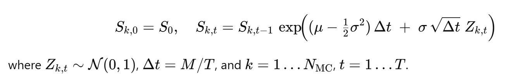
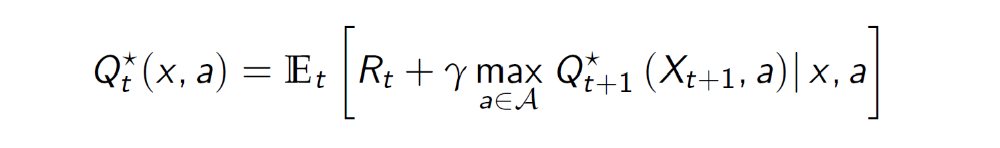
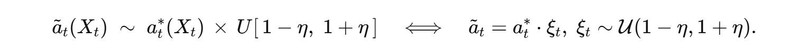
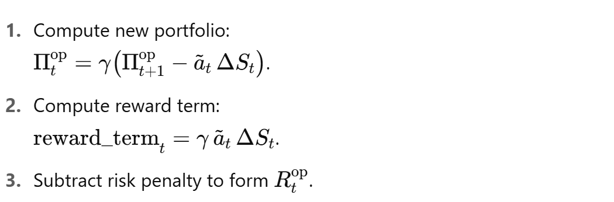
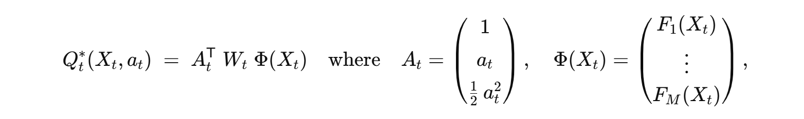
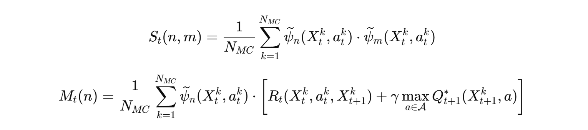

# HedgeGPT
Unlock next-generation option pricing and hedging with an AI-powered reinforcement-learning framework built on the Black–Scholes model

## 1) What Exactly Is HedgeGPT?
HedgeGPT is a high-performance AI-powered trading and risk-management engine designed to price and dynamically hedge European options. It harnesses both `on-policy` and `off-policy` reinforcement learning—namely `Q-learning` and `Fitted Q Iteration (FQI)`—to learn optimal hedging strategies directly from Monte Carlo market simulations.

Rather than relying purely on closed-form formulas like Black–Scholes, HedgeGPT uses B-spline encodings of simulated market states, then applies policy iteration and function approximation to discover and compare robust risk-aware strategies. The engine supports both `value-based` hedging and `variance-aware reward shaping`, making it suitable for research and deployment in realistic financial environments.

## 2) Key Features

**2.1) Monte Carlo Backbone**

* Simulates thousands of log-price paths under risk-neutral Black–Scholes dynamics, capturing realistic option payoffs and market uncertainty.
* Fully customizable asset dynamics, initial conditions, and volatility assumptions.

**2.2) B-Spline State Encoding**

* Encodes log-price states using B-spline basis functions, enabling smooth, expressive, and compact representations of the trading environment.
* Dynamically adjusts basis complexity based on time-to-maturity using a calibrated nearest-neighbor heuristic.

**2.3) Dual Reinforcement Learning Modes**

* On-Policy Q-Learning: Learns hedge strategies by maximizing the expected cumulative reward while actively exploring the market.
* Off-Policy Fitted Q Iteration (FQI): Learns from historical state-action transitions using least squares regression with regularization, enabling batch-mode learning and stable policy improvement.

**2.4) Reward Function with Risk-Aware Control**

* Incorporates a flexible variance-penalized reward of the form `reward = −(portfolio_variance + λ * hedge_cost),` directly balancing risk and return.
* The regularization parameter `λ` allows fine-tuning between aggressive payoff tracking and conservative hedging.

**2.5) Side-by-Side Black–Scholes Benchmark**

* Compares the `learned option` price from each RL agent with the analytic `Black–Scholes formula`, offering a direct and interpretable measure of model performance.
* Enables detailed validation and calibration of learning behavior.

## 3) Why Use HedgeGPT?
Whether you're a quant researcher, AI finance developer, or options theorist, HedgeGPT offers:

**Reinforcement Learning Meets Quant Finance:** Explore both online and offline RL techniques for solving classical hedging problems with modern AI.

**Full Control Over Model Components:** Swap in different reward functions, basis representations, or dynamics engines.

**Advanced Risk Modeling:** Penalty-based reward shaping gives you robust control over P&L volatility and replication accuracy.

**Transparency & Interpretability:** Compare Q-values, hedge ratios, and value estimates directly to textbook formulas.

**Educational & Research Tool:** Understand and visualize how AI discovers hedging strategies like delta hedging—and when it deviates intelligently.

 ## 4) How to Run the Project
Follow these steps to run the project:

**4.1) Clone the Repository**

```python
git clone https://github.com/YourUsername/HedgeGPT.git
```

**4.2) Navigate to the Project Directory**

```python
cd HedgeGPT
```

**4.3) Install the Required Packages**

```python
pip install -r requirements.txt
```

**4.4) Run the Script**

```python
python main.py
```

## 5) Core Formulas and Computations

Below is a detailed rundown of every mathematical formula used in main.py, organized by the five main computation stages

**5.1) Asset‐Price Simulation (Geometric Brownian Motion)**



What it is: A discrete‐time approximation to the continuous Black–Scholes dynamics.

Why we use it: We need a large ensemble of possible future paths `S` under the real-world drift `𝜇` to train our hedging agent. Even though pricing is risk‐neutral, we simulate with `𝜇` so that our state variables `𝑋` capture realistic drift.

How it fits: These simulated paths feed into both the replicating‐portfolio regression and the Q‐learning agent’s experience.

## 5.2) Discount Factor


What it is: The per‐step factor to discount monetary payoffs back one time increment.

Why we use it: In both the replicating‐portfolio rollback and the Q‐learning Bellman equation, future values must be discounted at the risk‐free rate 
`r`.

How it fits: Each backward step multiplies by `γ` to translate future cash flows into present value.

## 5.3) Risk‐Neutral Returns & Demeaning


What it is: The excess return beyond the growth at the risk‐free rate, then centered around zero.

Why we use it: In our regression for the hedge ratio, we need returns with zero mean so that the linear system 
`𝐴𝜙 = 𝐵` remains well‐conditioned.

How it fits: `^ΔS` enters the `A‐matrix` (variance weights) and the `B‐vector` (covariance with future portfolio payoffs).

## 5.4) State Variable


What it is: A drift‐corrected log‐price used as the input to spline basis functions.

Why we use it: By subtracting `(μ− 1/2σ)tΔt`, we remove the deterministic drift component and isolate the stochastic part of `lnS`.

How it fits: `X k,t` is what we “encode” via B‐splines to build our approximate value/hedge functions.

## 5.5) B‐Spline Basis Evaluation

1. Choose collocation points `{τi}` across the range of `X`.

2. Build a knot vector `k` of order `p=4`.

3. For each flattened x, evaluate `Bj​(x)=splev(x,(k, ej, p−1))`.

Reshape into a tensor of shape `(T+1, N MC, nbasis)`.

Why we use it: B‐splines provide a smooth, overcomplete set of basis functions that can flexibly approximate any value or hedge‐ratio function of the state.

How it fits: These basis evaluations become the design matrix `Φt` in both the replicating‐portfolio regression and the Q‐function regression.

## 5.6) Regression Matrix A(t)

.png)

What it is: A weighted Gram matrix of basis functions, with ridge regularization. 

Why we use it: It captures how each basis function’s squared return contributes to the “cost” of fitting the next‐step payoff. The regularizer stabilizes inversion.

How it fits: In solving `𝐴(𝑡)𝜙(𝑡) = 𝐵(𝑡)`, we obtain the regression coefficients `𝜙(𝑡)` that define the optimal hedge.

## 5.7) Regression Vector B(t)

.png)

What it is: The cross‐moment between basis functions and the “incremental P&L” plus a risk‐aversion penalty.

Why we use it: It represents the direction we should move our hedge coefficients to best align the portfolio’s next‐step payoff with the target.

How it fits: Together with `𝐴(𝑡)`, it yields `𝜙(𝑡)` for the optimal hedge ratio.

## 5.8) Backward Induction for Portfolio Π


What it is: 

1. Compute the hedge ratio `ak,t` as a linear combination of basis functions.
   
2. Roll back the portfolio value using discounted future portfolio minus cost of hedging trade `aΔS`

Why we use it: This enforces the self‐financing replication condition: changes in portfolio value come solely from the hedging position.

How it fits: Results in a full pathwise `Π`-table whose `time-0` average is the replicating‐portfolio price.

## 5.9) Variance‐Based Reward Function


What it is: A per‐step reward that rewards profitable hedging trades `γaΔS` but penalizes overall portfolio variance (risk)

Why we use it: Embeds the trade-off between return and risk directly into the Q‐learning objective, guiding the agent to stable, low-variance hedges.

How it fits: Feeds into the Q‐function regression as the target “immediate reward.”

## 5.10) Q‐Function Regression


What it is: A Bellman‐style regression that fits the action‐value function `Qt` in the same spline basis.

Why we use it: Approximates the long-run value of being in state `X k,t` and taking hedge `a k,t`, including future discounted rewards.

How it fits: The initial `Q:,0` average is our model’s final option price under the learned RL policy.


**Together, these formulas implement a complete on-policy reinforcement learning hedging pipeline, where the transition probabilities are assumed to be known. This enables accurate backward induction and value estimation, effectively blending classical financial theory with dynamic programming techniques.**

-----------------------------------------------------------------------------------------------------------------------------------------------------------------------------------------------------

**In contrast, our second approach tackles the more challenging and realistic setting where transition probabilities are unknown. To address this, we employ a Q-learning–based reinforcement learning framework, allowing the agent to learn optimal pricing and hedging strategies directly from simulated experience. The following formulas lay the foundation for this off-policy method.**

## When the model is unknown:

We try to approximately solve the Bellman optimality equation



by replacing expectations entering this equation by their empirical averages.

## 5.11) Noisy Hedge Action

What is it: A stochastic perturbation of the on‑policy hedge ratio `at∗(Xt)`, defined by



Why we use it: Introduces exploration around the optimal action to generate a richer, off‑policy dataset. By sampling ξt from a uniform band around 1, we ensure the agent sees both slightly over‑ and under‑hedged scenarios.

How it fits: The noisy action (at) is used in the reward calculation and portfolio rollback:



Thus, the uniform noise directly injects variability into the off‑policy experience, which the RL algorithm uses to learn a robust Q‑function without knowing true transition probabilities.

## 5.12) Quadratic Q‑Function Expansion

What it is: A representation of the optimal action‑value function Qt∗(Xt,at) as a quadratic form in the hedge at, using the same spline basis {𝐹𝑗(𝑋)} from the DP solution. Concretely:



and 𝑊𝑡 is a `3×𝑀` coefficient matrix.

Why we use it: Because 𝑄𝑡∗ is known to be quadratic in the hedge 𝑎𝑡 under the Black–Scholes assumptions, this expansion lets us reduce the infinite‑dimensional regression problem to estimating the finite‑dimensional weight matrix 𝑊𝑡.

How it fits: We reuse the same spline features `Φ(𝑋𝑡)` from on‑policy DP to build `Ψ𝑡 = 𝐴𝑡 ⊗ Φ(𝑋𝑡)` In off‑policy Bellman regression, we solve


and then reconstruct


providing a fully parametric, quadratic Q‑function that drives policy evaluation and improvement.

## 5.13) Alternative Q‑Function Decomposition

What is it: An equivalent form of the quadratic Q‑function expansion that factors out the time‑dependent weight vector


So that


Here 𝐴𝑡 = (1, 𝑎𝑡, 1/2𝑎𝑡**2)**𝑇 as before, and 𝑊_bar_𝑡(𝑋𝑡) is a length‑3 vector of state‑dependent coefficients.

Why we use it: By compressing `𝑊𝑡 Φ (𝑋𝑡)` into the single vector `𝑊_bar_𝑡(𝑋𝑡)`, we simplify notation and highlight that, at each time t, the Q‑value is a simple inner product between the action features 𝐴𝑡 and a state‑specific weight vector 𝑊_bar_𝑡.

How it fits: The terminal boundary conditions for 𝑊_bar_𝑇(𝑋𝑇) directly encode the payoff and risk penalty:


where 𝑃𝑇(𝑋𝑇) is the terminal payoff. These conditions seed the backward Bellman recursion, ensuring that the learned 𝑊_ba_𝑡 produces the correct terminal Q‑values and smoothly propagates value estimates back to 𝑡 = 0.

## 5.14) Vectorized Q‑Function Form (Hadamard Form)

What it is: An alternate formulation of the quadratic Q‑function that expresses the value as an inner product between a parameter vector and a state-action–dependent vector built via the Hadamard (element-wise) product.
We rewrite the Q-function as:


Here,
* `∘` represents the Hadamard (element-wise) product,
* `(->)` flattens a matrix into a column vector,
* `𝑊_bar_𝑡 = vec(𝑊𝑡)` is the parameter vector,
* `𝜓_bar_(𝑋𝑡,𝑎𝑡) = vec(𝐴𝑡 Φ (𝑋𝑡)**𝑇)` is the feature vector derived from the outer product of state and action terms.

Why we use it: This vectorized Hadamard form enables a linear-in-parameters structure that simplifies regression, gradient updates, and learning via least squares or stochastic optimization. It decouples the functional complexity of `𝑄` into a compact inner product, helping us express learning targets in matrix-vector form.

How it fits: This form is used throughout the backward recursion to learn the weights 𝑊_bar_𝑡 efficiently. By treating the Q-function as a dot product between basis-encoded features and learnable parameters, we can directly solve for 𝑊_bar_𝑡 using batched linear regression over simulated samples. This structure also allows us to introduce regularization and model selection seamlessly in our learning pipeline.

5.15) Off‑Policy FQI Regression Targets

What it is:
This formulation defines the `regression step in Off-Policy Fitted Q Iteration (FQI)` using Monte Carlo sample data. It solves a least-squares problem to fit the Q-function at time `𝑡`, based on observed state transitions and rewards.

We define the feature covariance matrix 𝑆𝑡 ∈ 𝑅𝑑×𝑑 and the regression target vector 𝑀𝑡 ∈ 𝑅𝑑 as:



Where: `𝜓_bar_𝑛(𝑋𝑡𝑘,𝑎𝑡𝑘)` is the 𝑛 - th element of the vectorized feature vector 𝜓_bar_(𝑋𝑡𝑘,𝑎𝑡𝑘), formed from the outer product of the action basis `𝐴𝑡` and state basis `Φ(𝑋𝑡𝑘)`.

Why we use it: This structure supports off-policy reinforcement learning, where the data does not need to be generated from the current policy. The matrix `𝑆𝑡` captures the correlations between basis features, while `𝑀𝑡` captures the target values for those features based on both reward and next-step Q-values.

By solving the system:


we obtain the weight vector 𝑊_bar_𝑡 that parameterizes the Q-function at time `𝑡`:


How it fits: This step is repeated for each 𝑡 = 𝑇−1, 𝑇−2,...,0 in a backward dynamic programming fashion, using the already-estimated 𝑄𝑡_star + 1 in the target computation. This recursion enables FQI to approximate the optimal Q-function over time without needing to follow the policy that generated the data.

## 5.16) Avoiding Overestimation in Q-learning with Analytic Optimal Action

What it is:
This formulation addresses the overestimation bias in Q-learning by avoiding numerical maximization of the Q-function. Instead of computing the Q-function at 𝑡+1 and numerically maximizing it over actions 𝑎𝑡 + 1, it leverages the quadratic structure of the model to analytically compute the optimal action 𝑎𝑡_star(𝑋𝑡), resulting in a stable, unbiased estimate of the policy.

We define the Q-function at time 𝑡 + 1 as a quadratic function in the action variable 𝑎_star_t + 1:


This is consistent with the model’s structure, where Q-values are represented as quadratic functions of the action.

**Why we use the analytic action**

To avoid bias introduced by maximization over noisy Q-estimates (a known issue in classical Q-learning), we do not directly maximize above Equation over all possible actions. Instead, we substitute the known optimal action 𝑎𝑡_star(𝑋𝑡), already derived in the on-policy setting, into the Q-function.

That optimal action is:


This formula for 𝑎𝑡_start was already derived earlier in the on-policy model. Now, in the off-policy setting, we reuse this same optimal analytic form to evaluate the Q-function more stably, instead of performing noisy maximizations.

Why we use it:

This analytic substitution has two major advantages:

* Avoids overestimation bias common in off-policy Q-learning caused by taking maximum over sample-based Q-values.

* Ensures consistency between on-policy and off-policy settings by using the same hedge formula.

How it fits: By plugging the known 𝑎𝑡_star into optimal Q equation, we obtain a stable Q-value for regression targets in the off-policy FQI step. 

This makes the process:

* mathematically grounded,

* computationally efficient, and

* consistent with the dynamic programming structure of our model.

This step is repeated in backward recursion over time steps 𝑡 = 𝑇 − 1, 𝑇 − 2,...., 0 just like in the on-policy algorithm, but now trained using off-policy data.

This final component of the algorithm ensures that value updates are accurate and reflect both the optimal policy and the market's risk-return trade-off, closing the loop in the backward Q-function propagation.

-----------------------------------------------------------------------------------------------------------------------------------------------------------------------------------------------------
**Note on Drift (μ) vs. Risk-Neutral Pricing:**
Our models simulates paths using the real-world drift μ, while the Black–Scholes formula assumes risk-neutral drift r. As μ moves away from r, the learned option price will diverge from the analytic Black–Scholes price because the agent is trained on trajectories that include this additional “real-world” drift component.
-----------------------------------------------------------------------------------------------------------------------------------------------------------------------------------------------------


