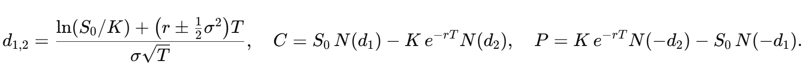
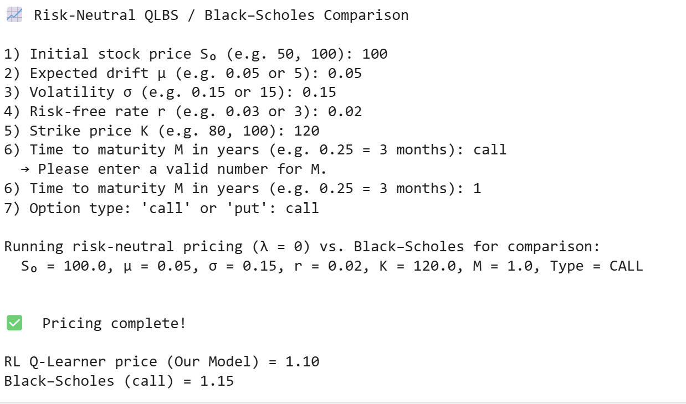
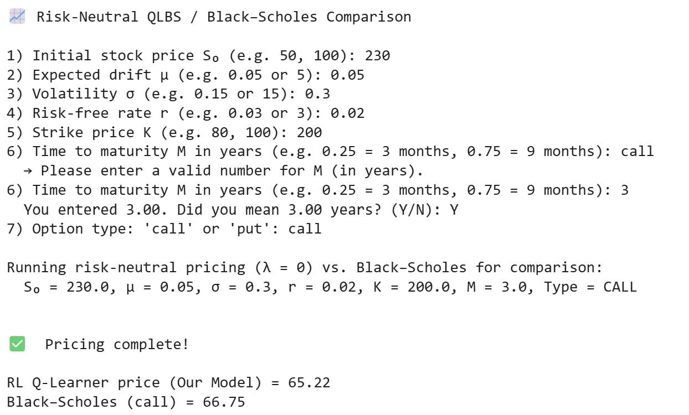

# HedgeGPT
Unlock next-generation option pricing and hedging with an AI-powered reinforcement-learning framework built on the Black–Scholes model

## 1) What Exactly Is HedgeGPT?
HedgeGPT is a high-performance AI-powered trading and risk-management engine designed to price and dynamically hedge European options. It harnesses both `on-policy` and `off-policy` reinforcement learning—namely `Q-learning` and `Fitted Q Iteration (FQI)`—to learn optimal hedging strategies directly from Monte Carlo market simulations.

Rather than relying purely on closed-form formulas like Black–Scholes, HedgeGPT uses B-spline encodings of simulated market states, then applies policy iteration and function approximation to discover and compare robust risk-aware strategies. The engine supports both `value-based` hedging and `variance-aware reward shaping`, making it suitable for research and deployment in realistic financial environments.

## 2) Key Features

**2.1) Monte Carlo Backbone**

* Simulates thousands of log-price paths under risk-neutral Black–Scholes dynamics, capturing realistic option payoffs and market uncertainty.
* Fully customizable asset dynamics, initial conditions, and volatility assumptions.

**2.2) B-Spline State Encoding**

* Encodes log-price states using B-spline basis functions, enabling smooth, expressive, and compact representations of the trading environment.
* Dynamically adjusts basis complexity based on time-to-maturity using a calibrated nearest-neighbor heuristic.

**2.3) Dual Reinforcement Learning Modes**

* On-Policy Q-Learning: Learns hedge strategies by maximizing the expected cumulative reward while actively exploring the market.
* Off-Policy Fitted Q Iteration (FQI): Learns from historical state-action transitions using least squares regression with regularization, enabling batch-mode learning and stable policy improvement.

**2.4) Variance-Based Reward Function**

* Penalizes portfolio volatility while rewarding accurate payoff replication, adapting dynamically to changing market conditions.

**2.5) Transparent Black–Scholes Benchmark**

* Directly compares the agent’s learned option price to the analytic Black–Scholes price, providing an intuitive gauge of model performance.

## 3) Why Use HedgeGPT?
Whether you’re a quant researcher, risk manager, or developer building automated strategies, HedgeGPT provides:

* Deep AI Integration: Combines reinforcement learning with classical finance theory.

* Risk-Aware Pricing: Explicit variance control yields robust option valuations.

* Extensibility: Swap in different reward functions, market simulators, or basis encodings.

* Educational Value: See firsthand how an AI agent discovers the famed delta‐hedging strategy.

 ## 4) How to Run the Project
Follow these steps to run the project:

**4.1) Clone the Repository**

```python
git clone https://github.com/YourUsername/HedgeGPT.git
```

**4.2) Navigate to the Project Directory**

```python
cd HedgeGPT
```

**4.3) Install the Required Packages**

```python
pip install -r requirements.txt
```

**4.4) Run the Script**

```python
python main.py
```

## 5) Core Formulas and Computations

Below is a detailed rundown of every mathematical formula used in main.py, organized by the five main computation stages

**5.1) Asset‐Price Simulation (Geometric Brownian Motion)**


What it is: A discrete‐time approximation to the continuous Black–Scholes dynamics.

Why we use it: We need a large ensemble of possible future paths `S` under the real-world drift `𝜇` to train our hedging agent. Even though pricing is risk‐neutral, we simulate with `𝜇` so that our state variables `𝑋` capture realistic drift.

How it fits: These simulated paths feed into both the replicating‐portfolio regression and the Q‐learning agent’s experience.

## 5.2) Discount Factor


What it is: The per‐step factor to discount monetary payoffs back one time increment.

Why we use it: In both the replicating‐portfolio rollback and the Q‐learning Bellman equation, future values must be discounted at the risk‐free rate 
`r`.

How it fits: Each backward step multiplies by `γ` to translate future cash flows into present value.

## 5.3) Risk‐Neutral Returns & Demeaning


What it is: The excess return beyond the growth at the risk‐free rate, then centered around zero.

Why we use it: In our regression for the hedge ratio, we need returns with zero mean so that the linear system 
`𝐴𝜙 = 𝐵` remains well‐conditioned.

How it fits: `^ΔS` enters the `A‐matrix` (variance weights) and the `B‐vector` (covariance with future portfolio payoffs).

## 5.4) State Variable


What it is: A drift‐corrected log‐price used as the input to spline basis functions.

Why we use it: By subtracting `(μ− 1/2σ)tΔt`, we remove the deterministic drift component and isolate the stochastic part of `lnS`.

How it fits: `X k,t` is what we “encode” via B‐splines to build our approximate value/hedge functions.

## 5.5) B‐Spline Basis Evaluation

1. Choose collocation points `{τi}` across the range of `X`.

2. Build a knot vector `k` of order `p=4`.

3. For each flattened x, evaluate `Bj​(x)=splev(x,(k, ej, p−1))`.

Reshape into a tensor of shape `(T+1, N MC, nbasis)`.

Why we use it: B‐splines provide a smooth, overcomplete set of basis functions that can flexibly approximate any value or hedge‐ratio function of the state.

How it fits: These basis evaluations become the design matrix `Φt` in both the replicating‐portfolio regression and the Q‐function regression.

## 5.6) Regression Matrix A(t)

.png)

What it is: A weighted Gram matrix of basis functions, with ridge regularization. 

Why we use it: It captures how each basis function’s squared return contributes to the “cost” of fitting the next‐step payoff. The regularizer stabilizes inversion.

How it fits: In solving `𝐴(𝑡)𝜙(𝑡) = 𝐵(𝑡)`, we obtain the regression coefficients `𝜙(𝑡)` that define the optimal hedge.

## 5.7) Regression Vector B(t)

.png)

What it is: The cross‐moment between basis functions and the “incremental P&L” plus a risk‐aversion penalty.

Why we use it: It represents the direction we should move our hedge coefficients to best align the portfolio’s next‐step payoff with the target.

How it fits: Together with `𝐴(𝑡)`, it yields `𝜙(𝑡)` for the optimal hedge ratio.

## 5.8) Backward Induction for Portfolio Π


What it is: 

1. Compute the hedge ratio `ak,t` as a linear combination of basis functions.
   
2. Roll back the portfolio value using discounted future portfolio minus cost of hedging trade `aΔS`

Why we use it: This enforces the self‐financing replication condition: changes in portfolio value come solely from the hedging position.

How it fits: Results in a full pathwise `Π`-table whose `time-0` average is the replicating‐portfolio price.

## 5.9) Variance‐Based Reward Function


What it is: A per‐step reward that rewards profitable hedging trades `γaΔS` but penalizes overall portfolio variance (risk)

Why we use it: Embeds the trade-off between return and risk directly into the Q‐learning objective, guiding the agent to stable, low-variance hedges.

How it fits: Feeds into the Q‐function regression as the target “immediate reward.”

## 5.10) Q‐Function Regression


What it is: A Bellman‐style regression that fits the action‐value function `Qt` in the same spline basis.

Why we use it: Approximates the long-run value of being in state `X k,t` and taking hedge `a k,t`, including future discounted rewards.

How it fits: The initial `Q:,0` average is our model’s final option price under the learned RL policy.

## 5.11) Black–Scholes Closed-Form Benchmark



What it is: The analytic solution for European call and put prices under the Black–Scholes assumptions.

Why we use it: Provides a clear, model‐based benchmark to assess how close our reinforcement-learning agent comes to the known “correct” price.

How it fits: Printed alongside the RL price to validate convergence and measure any residual bias.

**Together, these formulas implement a full reinforcement-learning‐driven hedging pipeline that both replicates and prices European options, blending classical financial theory with modern AI.**

## 6) Sample Pricing Results






**Note on Drift (μ) vs. Risk-Neutral Pricing:**
Our Q-learner simulates paths using the real-world drift μ, while the Black–Scholes formula assumes risk-neutral drift r. As μ moves away from r, the learned option price will diverge from the analytic Black–Scholes price because the agent is trained on trajectories that include this additional “real-world” drift component.


